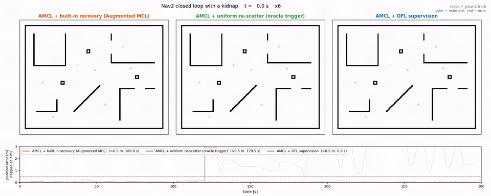

# Oriented Field Localization

[English](README.md) | 日本語

2D LiDAR スキャンと占有格子地図を、**画像空間で向き付き場 (壁質量 + 観測側を向く
単位法線) の FFT 相関**として照合し、地図座標の 3-DoF 姿勢 `(x, y, yaw)` を
**1 スキャンから初期位置なしで**推定する ROS 2 パッケージです。

初期化・再初期化時は地図全体を探索し (GLOBAL)、収束後は事前姿勢の周りを局所探索で
追い続けます (TRACK)。ICP 精密化・複数スキャン累積・内部オドメトリは持ちません。

## 成績 (9 地図 x 15 外乱条件 x 40 姿勢 = 5400 試行)

| 手法 | 成功率 | 1 スキャンあたり [s] |
|---|---:|---:|
| **本手法 GLOBAL** | **86.9%** | **0.010** (30x30 m 地図) / 0.025 (52x50 m) |
| **本手法 TRACK** (事前誤差 <= 3 m / 30 度) | **96.6%** | **0.005** / 0.005 |
| BBS (Olson/Hess 型 分枝限定相関) | 62.5% | 0.013 / 0.037 |
| Radon サイノグラム法 (姉妹パッケージの最良構成) | 85.7% | 0.060 / 0.084 |

Gazebo での連続走行 (240 秒・121 m) では**位置誤差 中央 0.04-0.06 m / 0.5 m 以内 100%
(3 走行)**、kidnap から **0.7 秒で復帰**します ([docs/simulation.md](docs/simulation.md))。
**Nav2 と閉ループ**に組み、地図に無い動く障害物を入れた 300 秒の走行 4 回では、位置誤差が
0.5 m を超えていた時間の合計が毎回 **0.1 -- 0.6 秒**でした (同条件の AMCL は 3 回中 2 回で
22 秒と 106 秒。[docs/nav2_closed_loop.md](docs/nav2_closed_loop.md))。

成功判定は「位置誤差 < 1.0 m かつ 角度誤差 < 15 度」。McNemar で BBS 比
p = 1.6e-278。TRACK は**窓の内側なら事前誤差の大きさによらず引き込み**、
自己相似な廊下地図で最も効きます (50.7% -> 84.5%)。**時間は地図の大きさに
依存しません**。条件・地図別の内訳と限界は
**[docs/benchmark.md](docs/benchmark.md)** にあります。

**BBS には探索の完全性の保証があり、本手法にはありません。**それでも差が付くのは
網羅性ではなくスコアの識別力の差です。BBS の尤度場は「点が壁の近くにあるか」しか
見ませんが、本手法は壁の**向き**まで一致を要求します。

## 手法

テンプレート (スキャン) と地図を 3 チャネルの場
`f = (mass, lam*mass*nx, lam*mass*ny)` に変換し、姿勢のスコアを

```text
s(p, alpha) = < f_map , R_alpha f_scan >_p / sqrt(E_scan)
```

とします。**分母をテンプレート側だけにする**のが要点で、候補位置ごとの地図側
エネルギーでも割ると候補間の比較可能性が壊れて順位付けが落ちます (実測 -12 pt)。

探索は画像ピラミッドの粗密探索です。粗段は角度ごとに 1 回の逆 DFT で**全位置の
スコア場**を一度に得て、角度ごとに上位ピークを NMS 付きで保持します。細段は候補ごとに
狭い角度・位置窓を疎な点列の直接相関で精密化します。詳細は
[docs/design.md](docs/design.md)。

## 依存関係

ROS 2 / `ament_cmake`、OpenCV、OpenMP (任意)。PCL は不要です。

## ビルド

```bash
colcon build --packages-select oriented_field_localization
source install/setup.bash
```

ROS を用意せずに検証する場合は Docker の最小環境で回せます。

```bash
./docker/run_ci.sh
```

## 起動

```bash
ros2 launch oriented_field_localization global_localization.launch.py \
  map_yaml_path:=/absolute/path/to/map.yaml
```

`map_yaml_path` を空にすると transient-local / reliable QoS の `/map` を待ちます。
推定はサービスで開始します。

```bash
ros2 service call \
  /oriented_field_localization/global_localization std_srvs/srv/Empty '{}'
```

スキャン受信ごとに自動実行する場合は `auto_localize: true` にします。

## ROS インターフェース

| 種別 | 名前 | 型 | 用途 |
|---|---|---|---|
| subscribe | `scan` | `sensor_msgs/msg/LaserScan` | 2D LiDAR スキャン |
| subscribe | `map` | `nav_msgs/msg/OccupancyGrid` | `map_yaml_path` 未指定時 |
| subscribe | `odom` | `nav_msgs/msg/Odometry` | `use_odometry: true` のとき |
| subscribe | `amcl_pose` | `geometry_msgs/msg/PoseWithCovarianceStamped` | `supervise_amcl: true` のとき |
| publish | `~/pose` | `geometry_msgs/msg/PoseWithCovarianceStamped` | 採択した姿勢 (毎回) |
| publish | `/initialpose` | 同上 | 引き継ぎ・再シードのとき (AMCL への受け渡し) |
| publish | `~/candidates` | `geometry_msgs/msg/PoseArray` | 候補の可視化・診断 |
| service | `~/global_localization` | `std_srvs/srv/Empty` | 追跡を捨てて GLOBAL からやり直す |
| TF | `map -> odom` または `map -> base_frame` | TF2 | `tf_mode` で選択 |

## 主要パラメータ

既定値は [config/params.yaml](config/params.yaml) が正です。

| パラメータ | 既定値 | 説明 |
|---|---:|---|
| `match_resolution` | `0.05` | マッチング格子 `[m/px]` |
| `max_range` | `10.0` | テンプレートに使う最大レンジ `[m]` |
| `min_range` | `0.0` | 至近レンジゲート `[m]`。0 で無効 |
| `margin_pixels` | `284` | 地図外周のゼロパディング `[px]` |
| `pyramid_levels` | `3` | 粗密探索の段数 |
| `coarse_angle_step` | `6` | 粗段の角度刻み `[deg]` |
| `peaks_per_angle` | `8` | 粗段で角度ごとに保持するピーク数 |
| `candidate_pool_size` | `15` | 残す候補数 |
| `wfrac_margin` | `1.05` | 拮抗時に WFRAC で選び直す比率。0 で無効 |
| `global_min_margin` | `1.05` | top1/top2 がこれ未満なら publish しない。**`max_accept_jump_m` を絞るならこれも要る** (GLOBAL のやり直しが増え、曖昧解を引きやすくなるため) |
| `enable_track` | `true` | false で常に GLOBAL |
| `track_search_m` | `3.0` | TRACK の位置探索半径 `[m]` |
| `track_angle_window_deg` | `30` | TRACK の角度探索幅 `[deg]` |
| `track_after_accepts` | `3` | 連続採択がこの回数で TRACK へ移る |
| `max_consecutive_rejects` | `5` | 連続棄却がこの回数で GLOBAL へ戻る |
| `max_accept_jump_m` | `0.5` | TRACK で事前姿勢からこれ以上跳んだ解は捨てる `[m]`。**1 スキャンの事前誤差より十分大きく、曖昧解までの距離より小さく**取る (0.5 m/s・10 Hz なら実移動 0.05 m) |
| `max_accept_yaw_deg` | `20.0` | 同上 `[deg]`。0 で無効 |
| `track_max_wfrac` | `0.35` | TRACK 中に壁へ載らない点の割合がこれを超えたら棄却。**誤ロックの検出はこれが担う**。地図に無い障害物がある環境では `0.45`--`0.50` |
| `update_min_d` | `0.2` | これだけ動くまで TRACK の探索をしない `[m]`。0 で毎スキャン。**検証 (WFRAC) は間引かない**ので誤ロック検出は毎スキャンのまま |
| `update_min_a_deg` | `15.0` | 同 `[deg]` |
| `update_max_interval_s` | `1.0` | 停止していても この間隔では探索する `[s]` |
| `use_odometry` | `true` | `/odom` で事前姿勢を伝播する |
| `publish_initialpose` | `true` | 初回ロック (と追跡喪失後の再取得) で `/initialpose` を出す |
| `initialpose_repeat` | `5` | `/initialpose` を出し直す回数。**購読者が居ない間は消費しない**。再送はシードをオドメトリで現在姿勢へ運んでから出す |
| `initialpose_ack_m` | `0.5` | 受領確認。シード後の `amcl_pose` がシードのこの距離以内に来たら**残りの再送を止める** (1 回の判断が repeat 回の撒き直しに増幅されるのを断つ)。`supervise_amcl` のときだけ働く |
| `initialpose_ack_deg` | `20.0` | 同 `[deg]`。0 で角度は見ない |
| `smooth_base_m` | `0.0` | **出力する姿勢だけ**を鈍らせる (内部の事前姿勢は生のまま)。0 で無効。穏やかに走る用途では `0.005` を推奨 |
| `smooth_gain` | `0.5` | 補正権限のうち運動量に比例するぶん。固定上限だと激しい機動で遅れる |
| `tf_mode` | `none` | `none` / `map_to_odom` (REP-105) / `map_to_base` |
| `supervise_amcl` | `false` | true で **AMCL の監視役**になる (下記)。`tf_mode: none` と組で使う |

重要な不変条件:

```text
margin_pixels >= ceil(max_range / match_resolution)                    # 必須
margin_pixels >= ceil(sqrt(2) * max_range / match_resolution) + 1      # 推奨
```

1 つめを下回るとテンプレートが地図の縁で切れ、縁付近の姿勢を構造的に探索できません
(ノードが自動で引き上げて警告します)。2 つめを満たすと相関の外挿が 0 になり、
粗段の DFT が最小になります (満たさないと粗段のコストが最大 2 倍になります)。

### 実測で決めた既定値

- `pyramid_levels: 3` — 2 段は 2 倍遅く精度は同等
- `coarse_angle_step: 6` — 3 度は +0.4 pt で 1.7 倍遅い。9 度以上は時間が減らず精度だけ落ちる
- `wfrac_margin: 1.05` — 9 地図で較正。1.3 (サイノグラム法向けの値) を当てると -1 pt
- `normal_weight: 1.0` — 0 (壁質量のみ) にすると -1.5 pt
- スレッド数は**物理コア数**に合わせること。論理コア数まで上げると 2 次元 FFT が
  SMT で取り合いになり 1.4 倍遅くなります

## テスト

```bash
colcon test --packages-select oriented_field_localization
colcon test-result --verbose
```

ROS 非依存の単体テストが 3 本あります。`test_matcher` (20 項目) はパラメータの
不変条件、既知姿勢の復元、候補プールの性質 (スコア降順・NMS 分離・上限)、WFRAC の
符号、TRACK の引き込みと窓の境界を検査します。`test_reseed_policy` (21 項目) は
AMCL 監視の判定 — 動く障害物で誤発火しないこと、姿勢が一致していれば撒き直さない
こと、連続回数と最小間隔 — を検査します。`test_seed_handoff` (22 項目) は
`/initialpose` の再送予算 — 購読者が居ない間は消費しないこと、AMCL の受領を
確認したら残りを止めること — を検査します。

## Gazebo での連続走行検証

Gazebo Classic の中でロボットを走らせます。**開ループ** (制御は真値、位置推定は
受け身の観測者) と**閉ループ** (Nav2 が位置推定の出力だけで走る) の両方を回します。

```bash
./sim/run_sim.sh  out 240                        # 開ループ
KIDNAP_AT=120 ./sim/run_sim.sh out_kidnap 240
./sim/run_nav2.sh out_nav2 300                   # 閉ループ (Nav2)
LOC=amcl DYNAMIC=1 ./sim/run_nav2.sh out_amcl 300   # AMCL + 動く障害物と比較
```

壁の定義 1 つから world と占有格子の両方を生成するので、world と地図がずれません。
測定と限界は [docs/simulation.md](docs/simulation.md) (開ループ) と
[docs/nav2_closed_loop.md](docs/nav2_closed_loop.md) (閉ループ)、環境の作りは
[sim/README.md](sim/README.md)。

**この検証で 2 つの欠陥が見つかり、修正しました。**

1. **跳び判定だけでは誤ロックを検出できない。**いったん誤った場所へ乗ると以後の
   事前姿勢もそこから出るので「跳んでいない」と見えてしまい、原理的に検出できません。
   事前姿勢に依存しない WFRAC を足して復帰するようになりました (復帰せず → 0.6 秒)。
2. **`/initialpose` の引き継ぎが起動レースで失われる。**初回ロックの 1 回だけ
   volatile で publish していたため、購読側 (AMCL) の activate が後になると黙って
   捨てられていました。`initialpose_repeat` 回だけ出し直すようにしました。

閉ループで分かった要点:

- **手法を分けるのは精度ではなく「間違っている時間の長さ」です。**瞬間の最大誤差は
  どちらも 8 -- 14 m 出ますが、誤差が 0.5 m を超えていた合計時間は本手法が 8 回の走行
  すべてで 1 秒未満、AMCL は動的障害物で 3 回中 2 回 (22 秒・106 秒)、kidnap では
  2 回中 2 回とも最後まで戻りませんでした
- **大域位置推定の跳びは無料ではありません。**局所 costmap は odom フレームにあるので、
  跳ぶと全軌道が無効になり `follow_path` が abort して 2.5 秒止まります
- **採否の 2 つのしきい値を再校正し、既定値を変えました** (`max_accept_jump_m` 2.0 -> 0.5、
  `global_min_margin` 1.0 -> 1.05)。中央値は動きませんが (走行ごとに 0.037-0.058 m と
  ばらつく範囲の中)、最大誤差が 1.4 m -> 0.33-0.46 m、0.5 m を超えていた時間が
  0.2 秒 -> 0 秒になります。**2 つは一緒に変える必要があります** — 跳び判定だけ絞ると
  GLOBAL のやり直しが増え、その 1 回ごとが曖昧解を引く「くじ」になります
- **`track_max_wfrac` の既定 0.35 は静的な地図に対する値です。**地図に無い障害物が
  あると正常時の WFRAC が 0.50 近くまで上がり、既定のままだと正常な観測を 300 秒に
  50 回棄却します。その環境では 0.45 -- 0.50 にします (誤差は変わりませんが、無駄な
  GLOBAL のやり直しが 15-18 回から 3-9 回に減ります)

## 評価ハーネス

BBS ベースラインと同一スキャンで比較する最小セットを [eval/](eval/) に置いています。
第三者データセットを同梱しないため、合成地図を生成して回す構成です。

```bash
cd eval && ./run_compare.sh out 40
```

`make_scans` の姿勢・外乱の乱数系列は姉妹パッケージ `radon_global_localization` の
`disturb_eval2 --dump` と同一なので、同じ地図・同じ試行数なら**バイト同一のスキャン**が
得られ、両パッケージの数値を直接並べられます。

## AMCL の監視役として使う

自分で `map -> odom` を出す代わりに、**既存の AMCL の横に置いて監視させる**構成も
できます。AMCL 側は `set_initial_pose: false` にするだけで、他は何も変えません。

```bash
ros2 launch oriented_field_localization amcl_supervisor.launch.py \
  map_yaml_path:=/absolute/path/to/map.yaml
```

このノードは、

- 起動時の初期姿勢を自動で与え (人が RViz で与えるのをやめられる)、
- 走行中も AMCL の姿勢を毎スキャン WFRAC で検証して、壊れていたら撒き直させます。

300 秒の閉ループ 8 走行での実測 ([docs/amcl_supervision.md](docs/amcl_supervision.md)):

| 条件 | 位置誤差 中央 | >0.5 m の合計 | 到達 | 実走行距離 |
|---|---:|---:|---:|---:|
| kidnap・監視なし (2 走行) | 1.40 / 1.27 m | **183 / 182 s** | 3/10, 3/11 | 27 / 26 m |
| kidnap・監視あり (2 走行) | **0.058 / 0.053 m** | **7.8 / 5.3 s** | 14/15, 14/15 | 132 / 134 m |
| 動的障害物・監視なし | 2.60 m | **253 s** | 4/11 | 43 m |
| 動的障害物・監視あり | **0.059 m** | **0.0 s** | 16/17 | 136 m |



同じ 300 秒の閉ループ (120 秒で kidnap) を、AMCL の復帰手段 3 つで並べたもの
(黒 = 真値、色 = 推定、赤線 = 誤差。動画本体は
[sim/videos/amcl_recovery_methods_3way_kidnap.mp4](sim/videos/amcl_recovery_methods_3way_kidnap.mp4)):

- **AMCL 内蔵の自動回復** (Augmented MCL、`recovery_alpha_slow/fast` 0.001/0.1。
  nav2 の既定は無効): ランダム注入で推定は動き回る (2.7--13.9 m) が収束せず、
  180 秒間ずっと >0.5 m
- **一様撒き直し** (`/reinitialize_global_localization`)、kidnap の 1 秒後に
  **オラクルで発動** (素の nav2 にはこのサービスを自動で呼ぶノードは無い):
  検知が完璧でも 2,000 パーティクルの一様撒きでは残り走行のあいだ 1--3 m を漂い、
  真の位置から 10 m 離れた場所で「目標到達」と誤認する場面もある
- **OFL 監視**: 単一スキャンの GLOBAL 解で撒き直し、>0.5 m は合計 0.8 秒

再現は `KIDNAP_AT=120 LOC=... ./sim/run_nav2.sh` で 3 条件を走らせ
(`AMCL_ARGS` / `REINIT_AT` は [sim/run_nav2.sh](sim/run_nav2.sh) 冒頭のコメント参照)、
[sim/render_compare_video.py](sim/render_compare_video.py) で描く。

**誤ロックの検出は WFRAC の絶対値ではできません。**地図に無い障害物があると正常時の
WFRAC そのものが 0.50 近くまで上がるためです。**同じスキャンで測った自分の WFRAC を
基準線にしてその差を見る**と、障害物は両方の姿勢に同じだけ乗るので相殺されます。
判定は [reseed_policy.hpp](include/oriented_field_localization/reseed_policy.hpp) に
ROS 非依存で置いてあり、単体テストが 21 項目あります。しきい値は 15 外乱条件 x
各クラス 1,800 サンプルの合成較正で裏付けてあります (誤発火 0/1800、誤ロック帯の
per-scan 検出 99.5%。`eval/run_reseed_margin.sh`、docs/amcl_supervision.md)。

**再シードは無料ではありません。**`/initialpose` はパーティクルを撒き直すので、それ自体が
姿勢の跳びを作り、局所 costmap が odom フレームにある以上は経路が無効になって
`follow_path` が abort します。そのため判定は連続回数と最小間隔で鈍らせてあり、
**AMCL が自分と同じ場所を指しているときは (起動時の引き継ぎを含めて) 再シードしません**。
さらに `/initialpose` の再送は、AMCL がシード近傍の姿勢を出してきた時点で受領と
みなして打ち切ります ([seed_handoff.hpp](include/oriented_field_localization/seed_handoff.hpp)。
1 回の再シード判断が `initialpose_repeat` 回の撒き直しに増幅されるのを断つため)。

## 姉妹パッケージとの関係

`radon_global_localization` は同じ表現をラドン変換 (サイノグラム) 空間で照合します。
本パッケージはその**画像空間対照**として始まり、9 地図の比較で成功率・速度とも上回った
ため独立させたものです。経緯・機構の分析・撤回した仮説は
`radon_global_localization/docs/image_space_control.md` に記録されています。

なお `radon_global_localization` は PLICP 精密化・内部オドメトリ (scan-to-scan ICP)・
複数スキャン累積まで持つ**より作り込まれたパッケージ**です。本パッケージは GLOBAL と
TRACK の探索そのものに絞ってあります。

## 構成

```text
oriented_field_localization/
├── include/oriented_field_localization/
│   ├── oriented_field_matcher.hpp
│   ├── reseed_policy.hpp            # AMCL 監視の判定 (ROS 非依存)
│   └── seed_handoff.hpp             # /initialpose 再送予算と受領確認 (ROS 非依存)
├── src/
│   ├── oriented_field_matcher.cpp   # ROS 非依存のマッチングライブラリ
│   └── ofl_node.cpp                 # ROS 2 ノード
├── launch/
│   ├── global_localization.launch.py  # 単体 (map -> odom を自分で出す)
│   └── amcl_supervisor.launch.py      # AMCL の監視役
├── config/params.yaml
├── tests/
│   ├── test_matcher.cpp
│   ├── test_reseed_policy.cpp
│   └── test_seed_handoff.cpp
├── sim/                             # Gazebo での連続走行検証
│   ├── make_env.py                  # 壁の定義から world・地図・経路を生成
│   ├── models/robot.urdf
│   ├── obstacle_node.py             # 地図に無い動く障害物
│   ├── drive_node.py                # [開ループ] 経路追従 (真値) と誤差記録
│   ├── run_sim.sh                   # [開ループ]
│   ├── nav2_drive_node.py           # [閉ループ] 目標の送信と航法込みの記録
│   ├── nav2_params.yaml             # [閉ループ] Nav2 の設定 (全条件で同一)
│   ├── run_nav2.sh                  # [閉ループ]
│   ├── render_compare_video.py      # 複数走行を同期再生する比較動画
│   └── docker/                      # Gazebo Classic + Nav2 の実行環境
├── eval/                            # BBS との比較ハーネス
│   ├── make_scans.cpp               # 姿勢サンプリング + 外乱スキャン生成
│   ├── ofl_eval.cpp                 # 本手法の評価器
│   ├── bbs_eval.cpp                 # BBS ベースライン
│   ├── make_synthetic_map.py
│   ├── summarize.py
│   ├── run_compare.sh
│   ├── reseed_margin_eval.cpp       # AMCL 監視しきい値の合成較正
│   ├── summarize_reseed.py
│   └── run_reseed_margin.sh
├── docker/                          # ビルド・テスト用の最小 ROS 2 環境
└── docs/
    ├── design.md                    # 設計と既知の制約
    ├── benchmark.md                 # BBS / Radon との比較
    ├── simulation.md                # Gazebo での連続走行検証 (開ループ)
    ├── nav2_closed_loop.md          # Nav2 との閉ループと動的障害物
    ├── amcl_supervision.md          # AMCL の監視と再シードの実測
    └── en/                          # 上記の英語版
```

## ライセンス

[MIT License](LICENSE)
